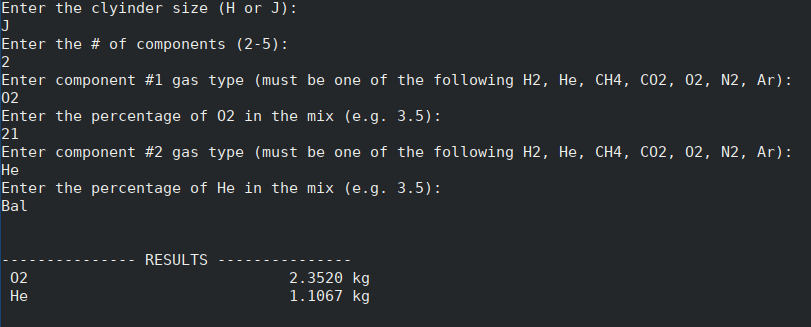

# gas-mix-calculator
A CLI script for calculating gas mix values. Takes the following input from the user:
  - Gas cylinder size (250 mol, 350 mol)
  - Gas components (e.g. H2, CO2, N2, etc.) and their percentage by volume 

  - The script then returns the weight (kilograms) of each component required to make the specified mix
  

## Modules Used

Python Standard Library
  - decimal - Used for rounding

## Who is it for?

I made this for myself to use at work as a QC chemist at an industrial compressed gas company. Anyone who makes similar gas mixtures will find it useful too.

## Created By

James Gibson  
github.com/jtgibson91  
jtgibson91@gmail.com
